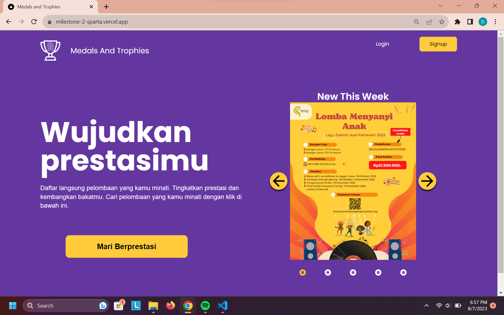
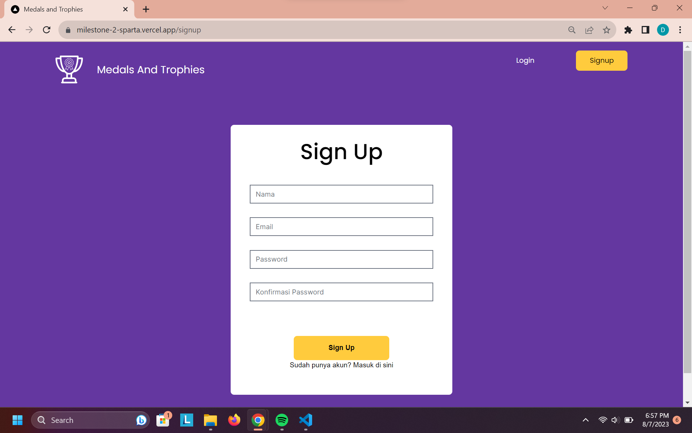
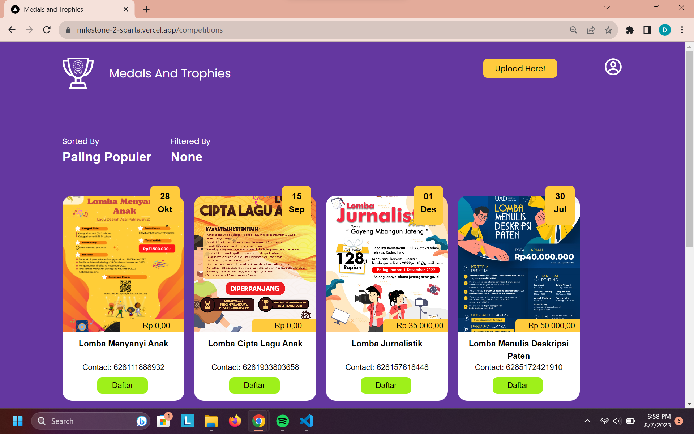
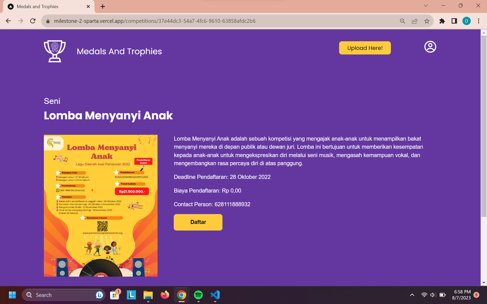
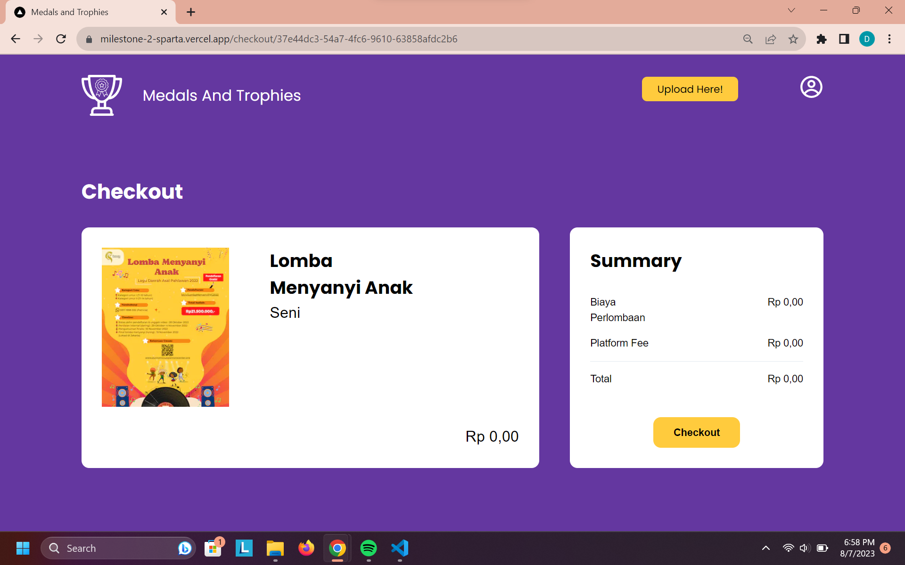
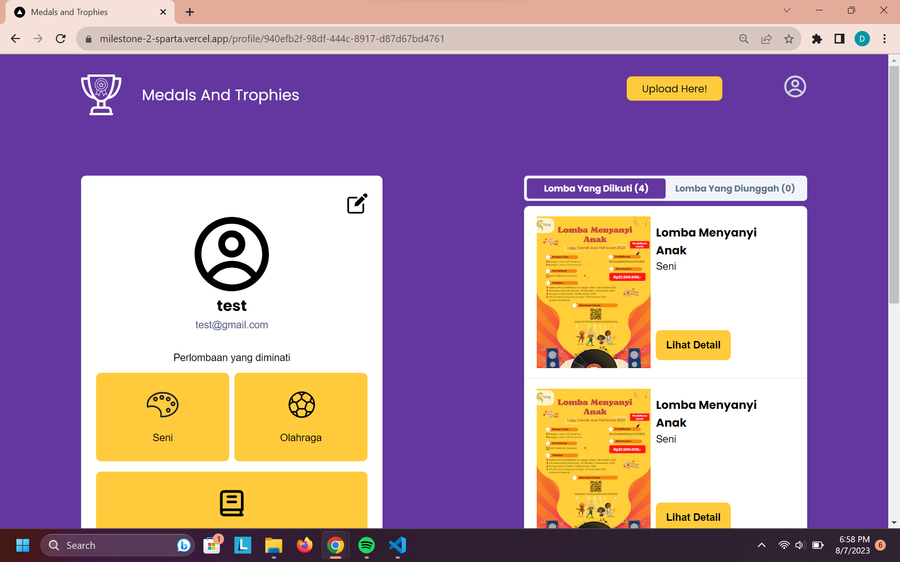
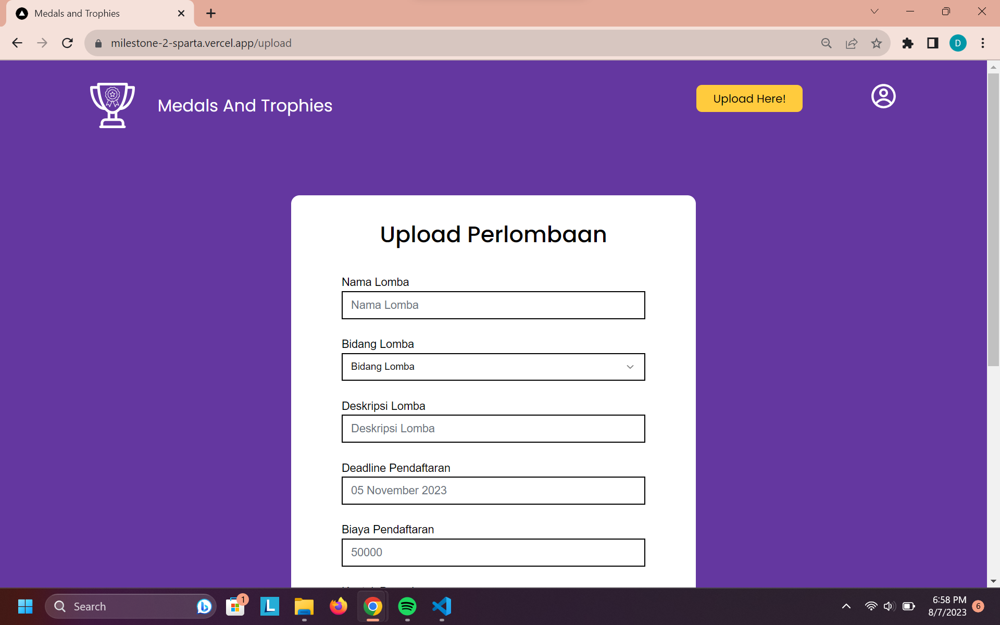

## Website Penyedia Informasi Lomba

Terdapat banyak jenis dan bidang perlombaan yang diadakan di berbagai tempat maupun tingkat yang berbeda seperti tingkat kota, provinsi, nasional, dan internasional. Namun hal tersebut tidak luput dari kesulitan mahasiswa dalam mencari informasi terkait perlombaan. Informasi yang tersebar di berbagai media sosial bahkan papan pengumuman kampus seringkali tidak terperinci, tidak terstruktur, atau terkadang tidak bisa di cek keasliannya.

Oleh karena itu, kami bermaksud menyajikan informasi perlombaan mahasiswa terpusat dalam bentuk website  yang akan menyediakan informasi yang akurat, lengkap, dan bisa dicek keasliannya mengenai berbagai bidang perlombaan yang ditujukan untuk mahasiswa.

## Cara Menggunakan 

Website dapat diakses pada link berikut [Link Website](https://milestone-2-sparta.vercel.app/)

#### Tampilan Homepage

 

Pengguna dapat melakukan sign in / log in pada bagian kanan atas untuk masuk ke website dan mendaftar lomba-lomba yang tersedia.

#### Tampilan Sign Up
 

#### Tampilan Daftar Perlombaan
 

 Setelah log in / sign up pengguna dapat melihat daftar pelombaan yang ada. Jika ingin mendaftar salah satu perlombaan, pengguna dapat menekan tombol Daftar pada lomba yang dipilih.

 

#### Tampilan Checkout
 
 Setelah memilih lomba, pengguna akan diarahkan ke tampilan checkout disini pengguna akan melakukan pembayaran dan juga terdapat keterangan biaya yang harus dibayarkan.

#### Tampilan Profile

Pada menu profile pengguna dapat melihat daftar riwayat lomba yang telah didaftarkan sebelumnya. Selain itu pengguna juga dapat mengedit profil mereka.

#### Tampilan Upload

Pengguna dapat meng-upload lomba juga dengan menekan tombol Upload Now di kanan atas. Di sini pengguna dapat mengisi keterangan lomba yang ingin diunggah.

## Kontribusi Anggota
- Abel Apriliani 19622008 : Membuat Laporan
- Debrina Veisha R W 19622009  : Membuat Checkout Page
- Albert 19622027 : Membuat Sign Up Page dan Edit Profile
- Wilson Yusda 19622055 : Membuat Popular Page
- Muhammad Kevinza Faiz	19622058 : Membuat Laporan
- Ahmad Naufal Ramadan	19622089 : Membuat This Week Page, Upload Page + BackEnd
- Elbert Chailes 19622127 : Membuat main page dan login page
- Azmi Mahmud Bazeid 19622167 : Membuat Laporan
- Mattheuw Suciadi Wijaya 19622188 : Membuat Laporan
- Moh Afnan Fawaz		19622227 : Membuat Laporan
- Bryan P. Hutagalung 		19622241 : Membuat Laporan
- Attara Majesta Ayub		19622265 : Membuat Laporan
- Muhammad Daffa K		19622288 : Membuat Laporan

## Link Proposal Milestone

https://docs.google.com/document/d/1alSPPXSjzXI6rT-LF2wRYfV3PXjRETH3rIr31YABOd4/edit?usp=sharing

This is a Next.js project bootstrapped with create-next-app.

Notes
Link Figma
Next.js App Routing
UI Library (Kalo mau pake, tergantung kebutuhan)
Getting Started
First, run the development server:

git clone https://github.com/ChaiGans/Milestone-2-SPARTA.git
# then
cd Milestone-2-SPARTA/src
# then
npm install react react-dom next
# then
npm run dev

# to update cloned repository
git pull
Open http://localhost:3000 with your browser to see the result.

You can start editing the page by modifying app/page.tsx. The page auto-updates as you edit the file.

This project uses next/font to automatically optimize and load Inter, a custom Google Font.

Dummy Account
Username: admin@gmail.com
Password: 1234
Tech Stack
Library:

React
Framework:

Next js (App route)
Tailwind CSS
Database:

Supabase (Postgresql)
uploadthing (File Uploads)
Auth:

NextAuth
ORM:

Prisma
UI Library:

Shadcn
Learn More
To learn more about Next.js, take a look at the following resources:

Next.js Documentation - learn about Next.js features and API.
Learn Next.js - an interactive Next.js tutorial.
You can check out the Next.js GitHub repository - your feedback and contributions are welcome!

Deploy on Vercel
The easiest way to deploy your Next.js app is to use the Vercel Platform from the creators of Next.js.

Check out our Next.js deployment documentation for more details.
